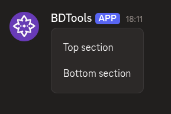
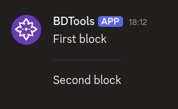

# $addSeparator

`$addSeparator` adds a **separator** component to the message. Separators create visual breaks between other components. They go inside containers or standalone without a parent.

---

## Syntax

```
$addSeparator[(Divider;Spacing;Container ID)]
```

All parameters are optional.

- `Divider`: set to `true` to show a visible line, `false` for just spacing.
- `Spacing`: the size of the spacing around the separator. Either `small` or `large`.
- `Container ID`: optional ID of the container to put this separator inside. Leave empty to use the separator standalone (not inside any container).

---

## What happens

1. `$addSeparator` creates a separator.
2. If you provide a container ID, it attaches to that container.
3. The separator adds a visual break between the components above and below it.

---

## Example 1: Small spacing without a divider

```
$addContainer[main]
$addTextDisplay[Top section;main]
$addSeparator[false;small;main]
$addTextDisplay[Bottom section;main]
```

**Result:**



What happens:

1. `$addContainer` creates a container.
2. The first text display appears at the top.
3. `$addSeparator` adds a divider line between them.
4. The second text display appears below the divider.

The separator creates a clear visual break between the two text displays.

---

## Example 2: Large spacing with a divider

```
$addTextDisplay[First block]
$addSeparator[true;large]
$addTextDisplay[Second block]
```

**Result:**



What happens:

1. The first text display appears on its own.
2. `$addSeparator` adds extra vertical space with no visible line, not attached to any container.
3. The second text display appears below.

The separator creates spacing without a dividing line.

---

## Common uses

- **Separating different sections** of content in a container
- **Adding spacing** between components for better readability
- **Grouping related content** with dividers
- **Standalone separators** when you need a break between uncontained components

---

## See also

- [$addContainer](../parents/$addContainer.md): to create a container for the separator
