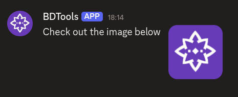
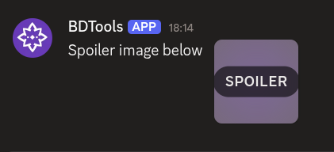

# $addThumbnail

`$addThumbnail` adds a **thumbnail** image to a section. Thumbnails appear beside the section's text as an accessory.

---

## Syntax

```
$addThumbnail[Image URL;Image description;Spoiler;Section ID]
```

- `Image URL`: the URL of the image to display.
- `Image description`: alt text for the image. Can be left empty.
- `Spoiler`: whether to mark the thumbnail as a spoiler. Leave empty for no spoiler.
- `Section ID`: ID of the section to attach this thumbnail to.

---

## What happens

1. `$addThumbnail` adds an image to the specified section.
2. The image appears beside the section's text.
3. If spoiler is set, the image is hidden behind a spoiler overlay.

---

## Example 1: Basic thumbnail

```
$addSection[info]
$addTextDisplay[Check out the image below;info]
$addThumbnail[https://example.com/image.png;Example image;;info]
```

**Result:**



What happens:

1. `$addSection` creates a section.
2. `$addTextDisplay` adds text to the section.
3. `$addThumbnail` adds an image to the section as its accessory.

The section shows the text with the image beside it.

---

## Example 2: Spoiler thumbnail

```
$addSection[info]
$addTextDisplay[Spoiler image below;info]
$addThumbnail[https://example.com/spoiler.png;Hidden image;true;info]
```

**Result:**



What happens:

1. `$addSection` creates a section.
2. `$addTextDisplay` adds text to the section.
3. `$addThumbnail` adds a spoiler image to the section.

The image is hidden behind a spoiler overlay until the user clicks it.

---

## Common uses

- **Adding images** to sections for visual context
- **Showing previews** of linked content
- **Hiding sensitive images** behind a spoiler

---

## See also

- [$addSection](../parents/$addSection.md): to create the section that holds the thumbnail
- [$addContainer](../parents/$addContainer.md): to create a container for the section
- [$addTextDisplay]($addTextDisplay.md): to add text to the section
