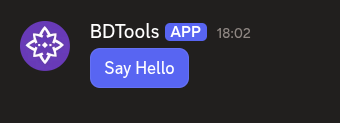
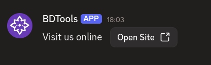

# $addButtonCV2

`$addButtonCV2` adds a **button** to an action row or section. Buttons can be interactive (with a custom ID) or link-style (with a URL).

---

## Syntax

```
$addButtonCV2[Button ID/URL;Label;Style;Disabled;Emoji;Action row ID / Section ID]
```

- `Button ID/URL`: custom ID for interactive buttons, or a URL for link-style buttons.
- `Label`: the text shown on the button.
- `Style`: the button color. One of `primary`, `secondary`, `success`, `danger`, or `link`. Use `link` for URL buttons. Defaults to primary.
- `Disabled`: set to `true` to make the button unclickable. Defaults to false.
- `Emoji`: an emoji to show on the button. Can be left empty.
- `Action row ID / Section ID`: ID of the action row or section to attach this button to.

---

## What happens

1. `$addButtonCV2` creates a button with the given ID and label.
2. The button attaches to the specified action row or section.
3. The button appears in your message. Interactive buttons respond to clicks, link buttons open URLs.

---

## Example 1: Interactive button in an action row

```
$addActionRow[actions]
$addButtonCV2[helloBtn;Say Hello;primary;;;actions]
```

**Result:**



What happens:

1. `$addActionRow` creates an action row.
2. `$addButtonCV2` adds a primary-colored button to the action row.

The action row shows a clickable button labeled "Say Hello".

---

## Example 2: Link button in a section

```
$addSection[links]
$addTextDisplay[Visit us online;links]
$addButtonCV2[https://example.com;Open Site;link;;;links]
```

**Result:**



What happens:

1. `$addSection` creates a section.
2. `$addTextDisplay` adds text to the section.
3. `$addButtonCV2` adds a link button as the section's accessory.

The section shows text with a link button beside it.

---

## Common uses

- **Adding interactive buttons** that trigger commands when clicked
- **Adding link buttons** that open external URLs
- **Providing multiple actions** in a row using several buttons

---

## See also

- [$addActionRow](../parents/$addActionRow.md): to create an action row for the button
- [$addSection](../parents/$addSection.md): to create a section for the button
