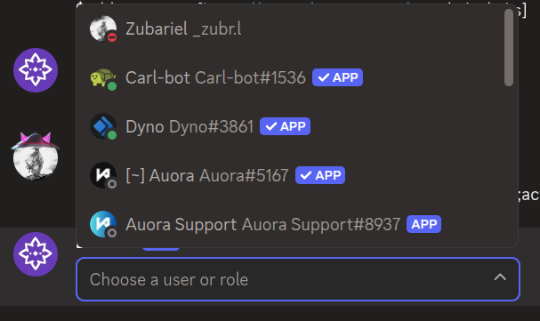
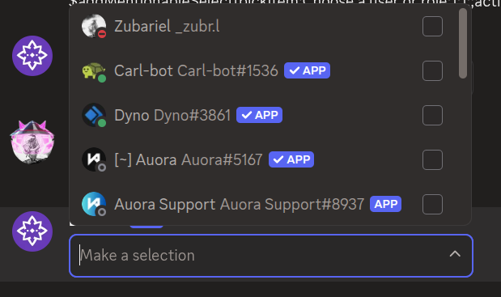

# $addMentionableSelect

`$addMentionableSelect` adds a **mentionable select menu** to an action row. Mentionable select menus let users pick one or more users **and** roles from a single list.

---

## Syntax

```
$addMentionableSelect[Select Menu ID;Placeholder;Min Values;Max Values;Disabled;Action Row ID]
```

- `Select Menu ID`: ID used to identify this menu in your command trigger.
- `Placeholder`: text shown when nothing is selected. Can be left empty.
- `Min Values`: minimum number of items that must be selected. Defaults to 1.
- `Max Values`: maximum number of items that can be selected. Defaults to 1.
- `Disabled`: set to `true` to make the menu unclickable. Defaults to false.
- `Action Row ID`: ID of the action row to attach this menu to.

---

## What happens

1. `$addMentionableSelect` creates a mentionable select menu on the specified action row.
2. When clicked, it opens a list of server members and roles to choose from.
3. The selected user and role IDs can be used in your command trigger.

---

## Example 1: Single mentionable select

```
$addActionRow[actions]
$addMentionableSelect[pickItem;Choose a user or role;1;1;;actions]
```

**Result:**



What happens:

1. `$addActionRow` creates an action row.
2. `$addMentionableSelect` adds a mentionable select menu that lets users pick one item.

The menu shows "Choose a user or role" as placeholder text.

---

## Example 2: Multi-select with no placeholder

```
$addActionRow[actions]
$addMentionableSelect[pickItems;;1;5;;actions]
```

**Result:**



What happens:

1. `$addActionRow` creates an action row.
2. `$addMentionableSelect` adds a mentionable select menu that lets users pick up to five items.

The menu has no placeholder text and allows multiple selections.

---

## Common uses

- **Selecting targets** where both users and roles are valid options
- **Building flexible permission or mention systems**

---

## See also

- [$addActionRow](../parents/$addActionRow.md): to create the action row for the menu
- [$addUserSelect]($addUserSelect.md): for selecting users only
- [$addRoleSelect]($addRoleSelect.md): for selecting roles only
