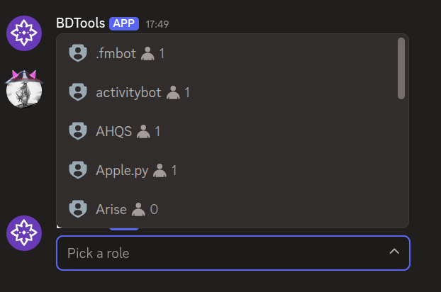
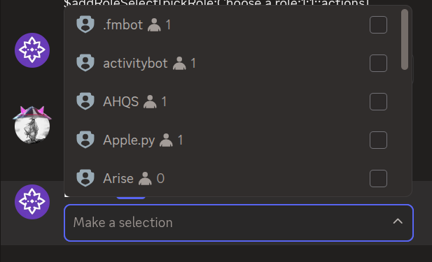

# $addRoleSelect

`$addRoleSelect` adds a **role select menu** to an action row. Role select menus let users pick one or more roles from a list.

---

## Syntax

```
$addRoleSelect[Select Menu ID;Placeholder;Min Values;Max Values;Disabled;Action Row ID]
```

- `Select Menu ID`: ID used to identify this menu in your command trigger.
- `Placeholder`: text shown when nothing is selected. Can be left empty.
- `Min Values`: minimum number of roles that must be selected. Defaults to 1.
- `Max Values`: maximum number of roles that can be selected. Defaults to 1.
- `Disabled`: set to `true` to make the menu unclickable. Defaults to false.
- `Action Row ID`: ID of the action row to attach this menu to.

---

## What happens

1. `$addRoleSelect` creates a role select menu on the specified action row.
2. When clicked, it opens a list of server roles to choose from.
3. The selected role IDs can be used in your command trigger.

---

## Example 1: Single role select

```
$addActionRow[actions]
$addRoleSelect[pickRole;Choose a role;1;1;;actions]
```

**Result:**



What happens:

1. `$addActionRow` creates an action row.
2. `$addRoleSelect` adds a role select menu that lets users pick one role.

The menu shows "Choose a role" as placeholder text.

---

## Example 2: Multi-select with no placeholder

```
$addActionRow[actions]
$addRoleSelect[pickRoles;;1;5;;actions]
```

**Result:**



What happens:

1. `$addActionRow` creates an action row.
2. `$addRoleSelect` adds a role select menu that lets users pick up to five roles.

The menu has no placeholder text and allows multiple selections.

---

## Common uses

- **Letting users pick their own roles** in a role menu
- **Selecting roles** for moderation or configuration commands

---

## See also

- [$addActionRow](../parents/$addActionRow.md): to create the action row for the menu
- [$addUserSelect]($addUserSelect.md): for selecting users instead of roles
- [$addMentionableSelect]($addMentionableSelect.md): for selecting users and roles
