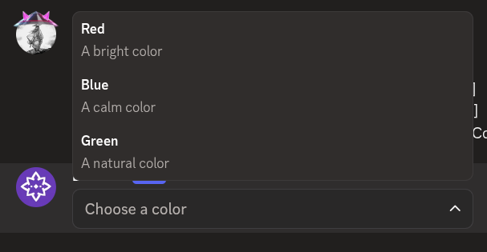
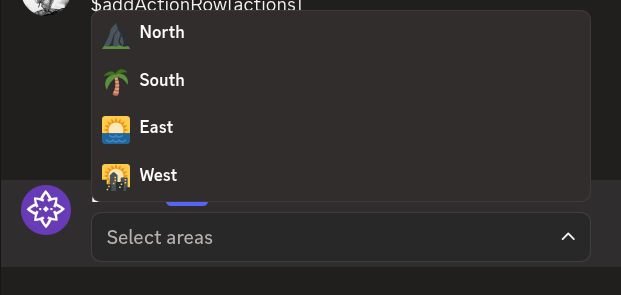

# $addStringSelect

`$addStringSelect` adds a **string select menu** to an action row. String select menus let users pick from custom options you define with `$addStringSelectOption`.

---

## Syntax

```
$addStringSelect[Select Menu ID;Placeholder;Min Values;Max Values;Disabled;Action Row ID]
```

- `Select Menu ID`: ID used to identify this menu in your command trigger.
- `Placeholder`: text shown when nothing is selected. Can be left empty.
- `Min Values`: minimum number of options that must be selected. Defaults to 1.
- `Max Values`: maximum number of options that can be selected. Defaults to 1.
- `Disabled`: set to `true` to make the menu unclickable. Defaults to false.
- `Action Row ID`: ID of the action row to attach this menu to.

---

## What happens

1. `$addStringSelect` creates an empty string select menu on the specified action row.
2. You add options to it with `$addStringSelectOption`.
3. The menu shows the options you added for users to pick from.

---

## Example 1: Color picker

```
$addActionRow[actions]
$addStringSelect[pickColor;Choose a color;1;1;;actions]
$addStringSelectOption[Red;red;A bright color;;;pickColor]
$addStringSelectOption[Blue;blue;A calm color;;;pickColor]
$addStringSelectOption[Green;green;A natural color;;;pickColor]
```

**Result:**



What happens:

1. `$addActionRow` creates an action row.
2. `$addStringSelect` creates a string select menu.
3. Three `$addStringSelectOption` calls add color options to the menu.

The menu shows three color options to pick from.

---

## Example 2: Multi-select menu

```
$addActionRow[actions]
$addStringSelect[pickAreas;Select areas;1;3;;actions]
$addStringSelectOption[North;north;;⛰️;;pickAreas]
$addStringSelectOption[South;south;;🌴;;pickAreas]
$addStringSelectOption[East;east;;🌅;;pickAreas]
$addStringSelectOption[West;west;;🌇;;pickAreas]
```

**Result:**



What happens:

1. `$addActionRow` creates an action row.
2. `$addStringSelect` creates a menu that lets users pick up to three options.
3. Four `$addStringSelectOption` calls add options with emojis.

The menu shows four options and users can select up to three of them.

---

## Common uses

- **Creating custom selection menus** with your own options
- **Building multi-select forms** for user input
- **Offering predefined choices** in a clean dropdown

---

## See also

- [$addStringSelectOption]($addStringSelectOption.md): to add options to the menu
- [$addActionRow](../parents/$addActionRow.md): to create the action row for the menu
