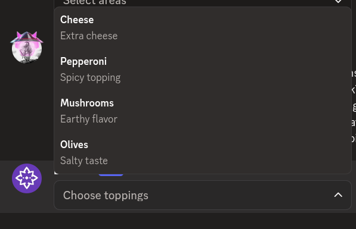
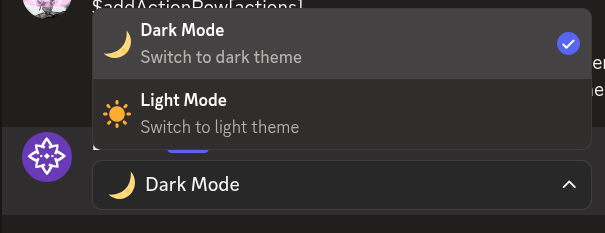

# $addStringSelectOption

`$addStringSelectOption` adds an **option** to a string select menu. Call this after `$addStringSelect` to build the list of choices.

---

## Syntax

```
$addStringSelectOption[Label;Value;Description;Emoji;Default;Select Menu ID]
```

- `Label`: the text shown to the user (max 100 characters).
- `Value`: the value sent to your bot when this option is selected (max 100 characters).
- `Description`: additional text shown below the label. Can be left empty.
- `Emoji`: an emoji to display next to the option. Can be left empty.
- `Default`: set to `true` to pre-select this option. Defaults to false.
- `Select Menu ID`: ID of the string select menu to add this option to.

---

## What happens

1. `$addStringSelectOption` adds a new option to the specified string select menu.
2. The option appears in the menu alongside any other options.
3. If set as default, it is pre-selected when the menu opens.

---

## Example 1: Multi-select options

```
$addActionRow[actions]
$addStringSelect[pickToppings;Choose toppings;1;3;;actions]
$addStringSelectOption[Cheese;cheese;Extra cheese;;;pickToppings]
$addStringSelectOption[Pepperoni;pepperoni;Spicy topping;;;pickToppings]
$addStringSelectOption[Mushrooms;mushrooms;Earthy flavor;;;pickToppings]
$addStringSelectOption[Olives;olives;Salty taste;;;pickToppings]
```

**Result:**



What happens:

1. `$addActionRow` creates an action row.
2. `$addStringSelect` creates a menu that lets users pick up to three options.
3. Four `$addStringSelectOption` calls add topping options with descriptions.

The menu shows four options with descriptions. Users can select up to three.

---

## Example 2: Option with a default

```
$addActionRow[actions]
$addStringSelect[pickSettings;Settings;1;1;;actions]
$addStringSelectOption[Dark Mode;dark;Switch to dark theme;🌙;true;pickSettings]
$addStringSelectOption[Light Mode;light;Switch to light theme;☀️;;pickSettings]
```

**Result:**



What happens:

1. `$addActionRow` creates an action row.
2. `$addStringSelect` creates a string select menu.
3. The first option has an emoji and is selected by default.
4. The second option has an emoji and no default.

The menu shows both options with emojis, and Dark Mode is pre-selected.

---

## Common uses

- **Building custom menus** with descriptive labels
- **Adding visual appeal** with emojis next to options
- **Pre-selecting common choices** using the default parameter

---

## See also

- [$addStringSelect]($addStringSelect.md): to create the menu that holds options
- [$addActionRow](../parents/$addActionRow.md): to create the action row for the menu
