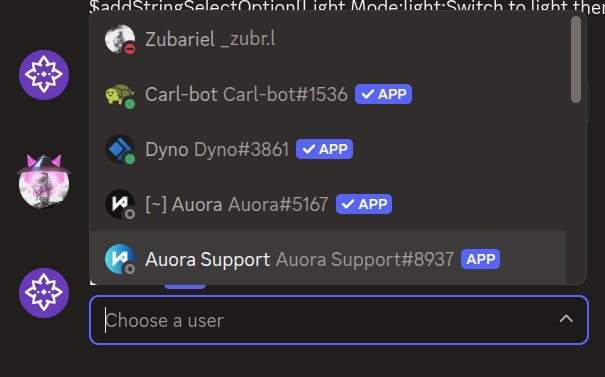
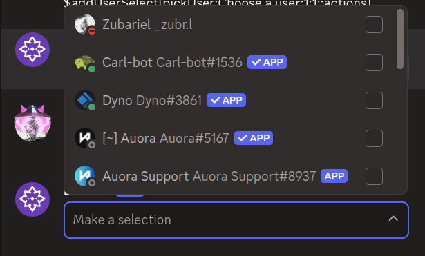

# $addUserSelect

`$addUserSelect` adds a **user select menu** to an action row. User select menus let users pick one or more members from a list.

---

## Syntax

```
$addUserSelect[Select Menu ID;Placeholder;Min Values;Max Values;Disabled;Action Row ID]
```

- `Select Menu ID`: ID used to identify this menu in your command trigger.
- `Placeholder`: text shown when nothing is selected. Can be left empty.
- `Min Values`: minimum number of users that must be selected. Defaults to 1.
- `Max Values`: maximum number of users that can be selected. Defaults to 1.
- `Disabled`: set to `true` to make the menu unclickable. Defaults to false.
- `Action Row ID`: ID of the action row to attach this menu to.

---

## What happens

1. `$addUserSelect` creates a user select menu on the specified action row.
2. When clicked, it opens a list of server members to choose from.
3. The selected user IDs can be used in your command trigger.

---

## Example 1: Simple user select

```
$addActionRow[actions]
$addUserSelect[pickUser;Choose a user;1;1;;actions]
```

**Result:**



What happens:

1. `$addActionRow` creates an action row.
2. `$addUserSelect` adds a user select menu that lets users pick one member.

The menu shows "Choose a user" as placeholder text.

---

## Example 2: Multi-select with no placeholder

```
$addActionRow[actions]
$addUserSelect[pickUsers;;1;3;;actions]
```

**Result:**



What happens:

1. `$addActionRow` creates an action row.
2. `$addUserSelect` adds a user select menu that lets users pick up to three members.

The menu has no placeholder text and allows multiple selections.

---

## Common uses

- **Selecting a member** for moderation actions
- **Picking multiple users** for role assignments or team building

---

## See also

- [$addActionRow](../parents/$addActionRow.md): to create the action row for the menu
- [$addRoleSelect]($addRoleSelect.md): for selecting roles instead of users
- [$addMentionableSelect]($addMentionableSelect.md): for selecting users and roles
