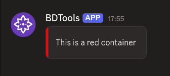

# $addContainer

`$addContainer` creates a **container** component. A container is a top-level component that groups other components together. Containers can hold `$addSection`, `$addActionRow`, `$addMediaGallery`, `$addTextDisplay`, and `$addSeparator`.

---

## Syntax

```
$addContainer[ID;(Color;Spoiler)]
```

- `ID`: a name to identify this container. Other components use this ID to attach themselves to it.
- `Color`: optional color for the container (e.g. `ff0000` for red).
- `Spoiler`: optional. Set to `true` to mark the container as a spoiler.

---

## What happens

1. `$addContainer` creates a container with the given ID.
2. Other components that reference that ID are placed inside it.
3. The container groups those components visually in the message.

---

## Example 1: Basic container

Create a container and put a text display inside it:

```
$addContainer[main]
$addTextDisplay[Welcome to the server!;main]
```

**Result:**


What happens:

1. `$addContainer` creates a container named `main`.
2. `$addTextDisplay` attaches its text to that container.
3. The message shows the text grouped inside the container.

To add more components, reference the same container ID. See [$addTextDisplay](../display/$addTextDisplay.md) for details.

---

## Example 2: Container with a color

Create a red container:

```
$addContainer[panel;ff0000]
$addTextDisplay[This is a red container;panel]
```

**Result:**



What happens:

1. `$addContainer` creates a container with a red border/background.
2. `$addTextDisplay` adds text inside that container.

The color applies to the whole container. Components inside it share the container's visual grouping.

---

## Common uses

- **Grouping related components** together in a single visual block
- **Organizing complex messages** with multiple sections and action rows
- **Adding color or spoiler markings** to parts of a message

---

## See also

- [$addSection]($addSection.md): to create a section inside a container
- [$addActionRow]($addActionRow.md): to create an action row inside a container
- [$addTextDisplay](../display/$addTextDisplay.md): to add text to a container
- [$addSeparator](../display/$addSeparator.md): to add a visual divider inside a container
