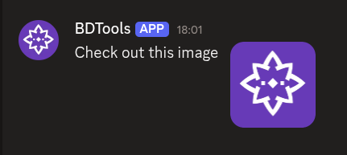

# $addSection

`$addSection` creates a **section** component. A section groups a `$addTextDisplay` with an accessory: either a `$addThumbnail` or a `$addButtonCV2`. Sections can go inside containers.

---

## Syntax

```
$addSection[ID;(Container ID)]
```

- `ID`: a name to identify this section. Other components use this ID to attach themselves to it.
- `Container ID`: optional ID of the container to put this section inside.

---

## What happens

1. `$addSection` creates a section with the given ID.
2. You add a text display to it with `$addTextDisplay`.
3. You add an accessory: `$addThumbnail` or `$addButtonCV2`.
4. The section displays the text with the accessory beside it.

---

## Example 1: Section with a thumbnail

```
$addSection[info]
$addTextDisplay[Check out this image;info]
$addThumbnail[https://example.com/image.png;Example image;;info]
```

**Result:**



What happens:

1. `$addSection` creates a section.
2. `$addTextDisplay` adds text to the section.
3. `$addThumbnail` adds a thumbnail image to the section.

The section shows the text with the image on the side.

---

## Example 2: Section with a button

```
$addSection[standalone]
$addTextDisplay[Click the button;standalone]
$addButtonCV2[exampleButton;Click Me;secondary;;;standalone]
```

**Result:**


What happens:

1. `$addSection` creates a section directly on the message.
2. `$addTextDisplay` adds text to the section.
3. `$addButtonCV2` adds a button as the section's accessory.

The section shows the text with a button beside it.

---

## Common uses

- **Displaying info with an image** using a thumbnail
- **Adding a button** to a block of text
- **Structuring messages** with multiple content blocks inside a container

---

## See also

- [$addContainer]($addContainer.md): to create a container for the section
- [$addTextDisplay](../display/$addTextDisplay.md): to add text to the section
- [$addThumbnail](../display/$addThumbnail.md): to add a thumbnail to the section
- [$addButtonCV2](../interactive/$addButtonCV2.md): to add a button to the section
